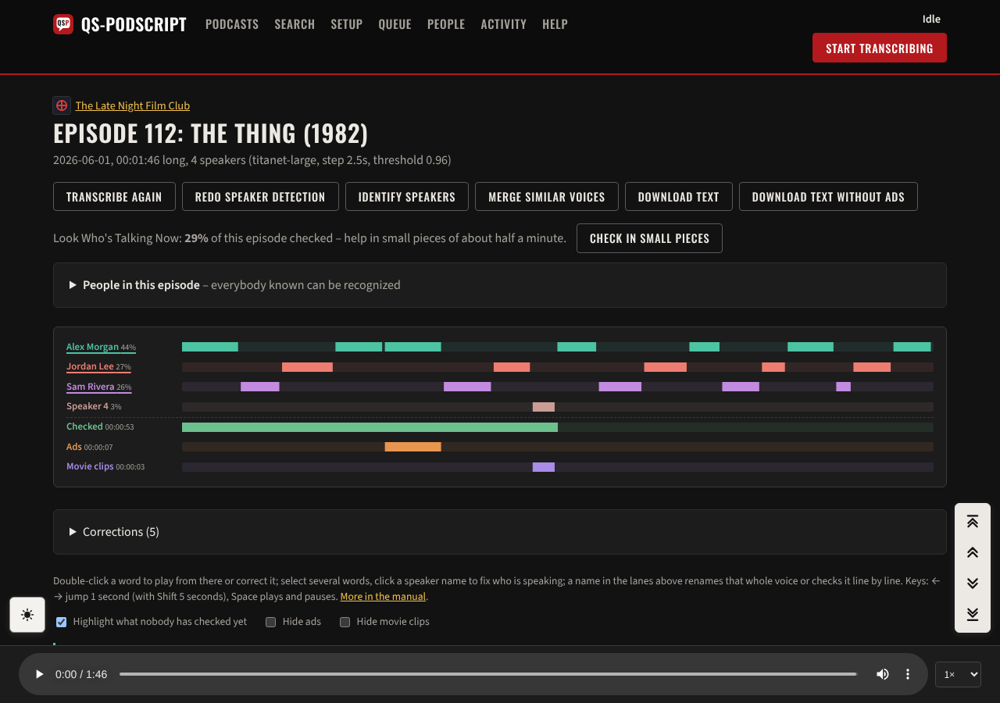
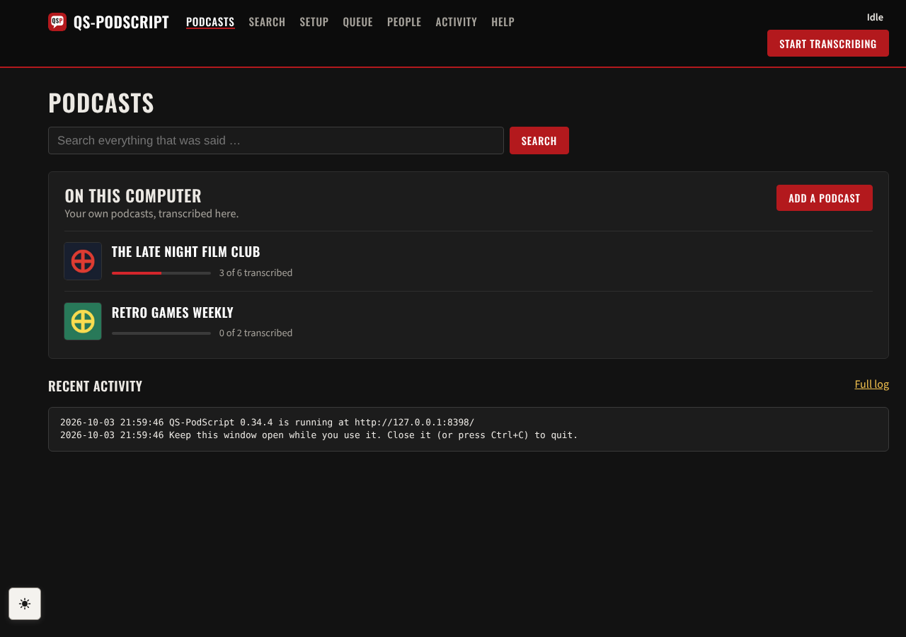
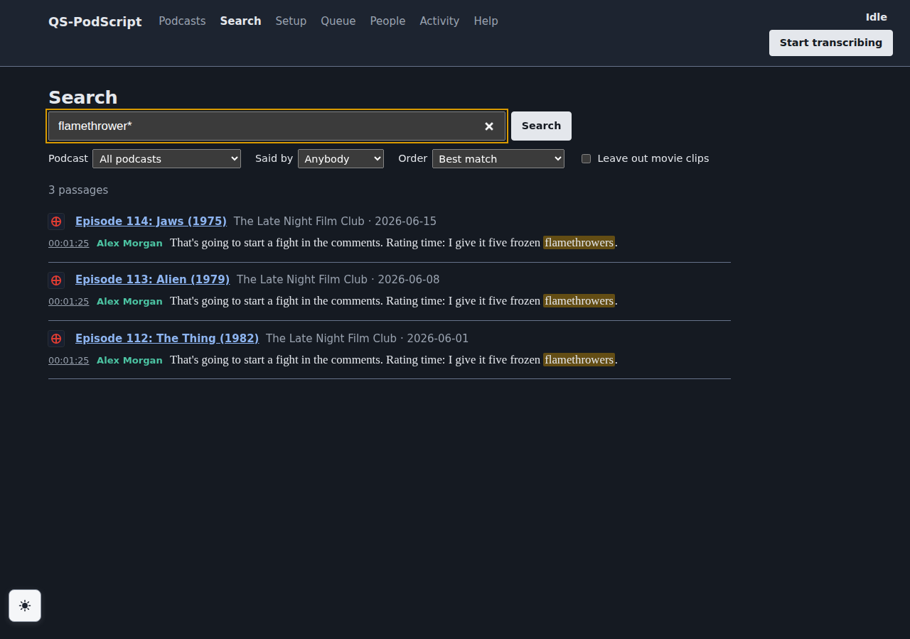
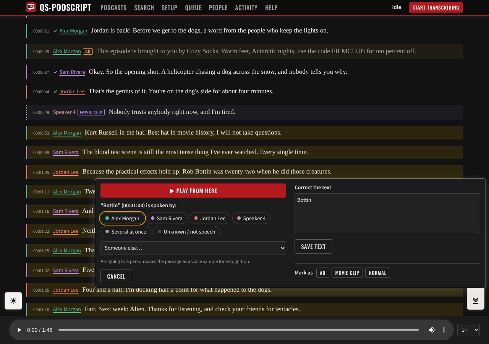
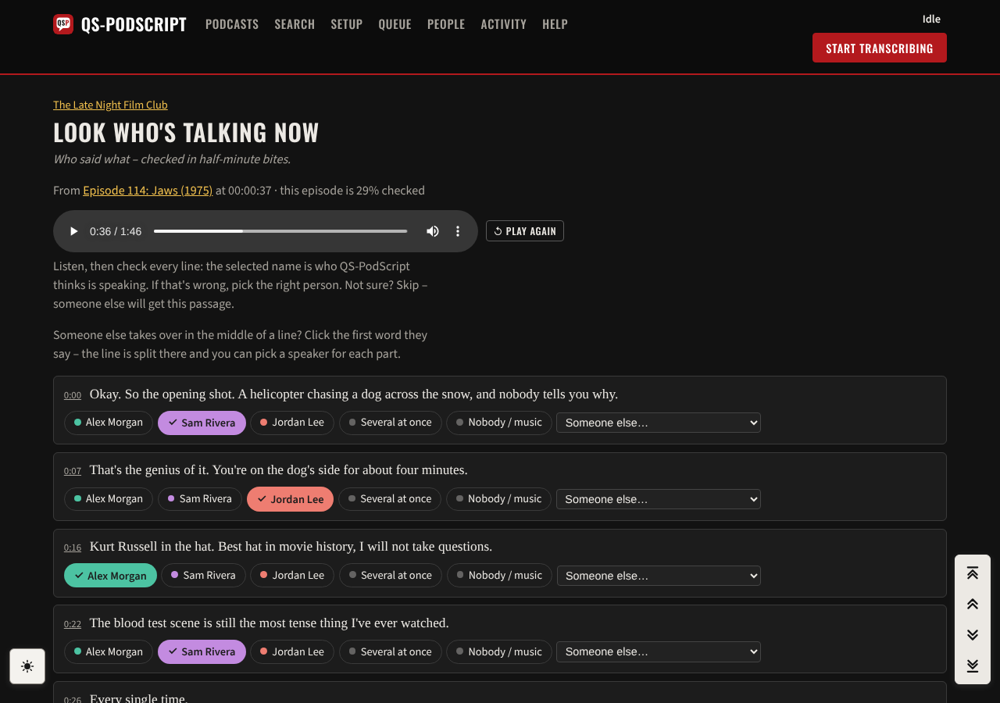
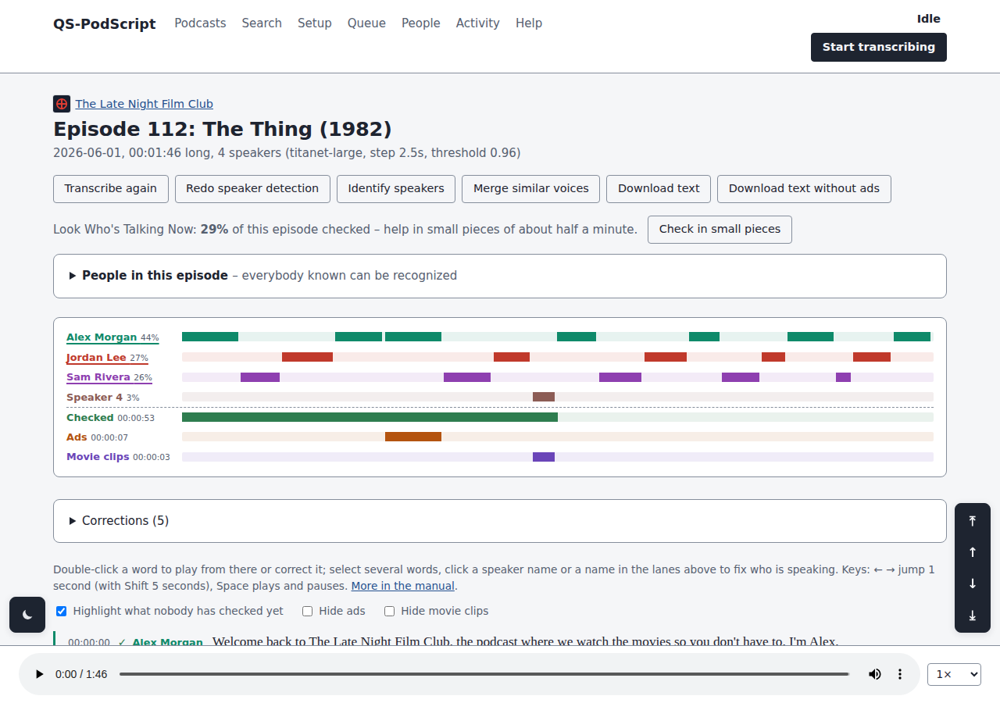
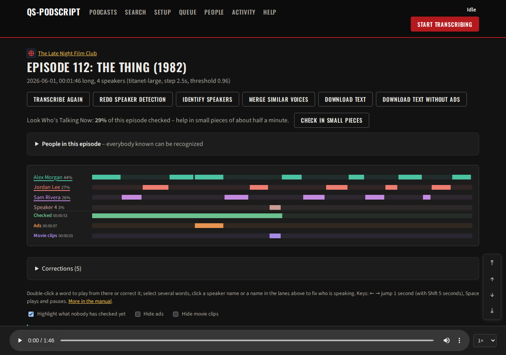

# QS-PodScript

**Podcast transcripts with speaker names – on your own computer, or shared by a group of volunteers.**


`Made with AI - Its the only way I was able to even get close to what i wanted. Feel free to NOT use this. :)`


QS-PodScript follows podcast feeds, transcribes every episode with
[whisper.cpp](https://github.com/ggml-org/whisper.cpp), works out **who said
what** with [sherpa-onnx](https://github.com/k2-fsa/sherpa-onnx), recognizes
known voices across episodes and lets people clean the result up in the
browser. It can also run as a **shared server**: everybody can read, listen
along and search; volunteers fix speakers and words, and their computers
(with graphics cards) do the transcribing.

[](https://github.com/baumbatz/qs-podscript/actions/workflows/ci.yml)
[](https://github.com/baumbatz/qs-podscript/releases/latest)
[](LICENSE)



## Features

- **Podcast feeds in, transcripts out.** Add a feed (also archive feeds), and
  QS-PodScript transcribes the episodes oldest first – or the ones you put at
  the top of the queue. Long episodes are transcribed in pieces, so nothing is
  skipped and Whisper can't get stuck in loops.
- **Who said what.** Speaker detection with a choice of voice models, known
  people recognized by their voice samples, hosts and regulars per podcast,
  "who is (not) in this episode".
- **Fixing it is quick.** Double-click a word to listen or correct it, select
  words to assign a speaker, mark ads and movie clips, spelling fixes for
  names Whisper keeps getting wrong. "Transcribe again" keeps all corrections.
- **Look Who's Talking Now** – check speakers in half-minute bites instead of
  facing a whole episode. Checked passages are marked for everybody.
- **Listen along.** The current word is highlighted while the episode plays.
- **Search** everything that was said (SQLite FTS5): phrases, word beginnings,
  by podcast or by person; a hit opens the episode at that spot.
- **Shared server** with public read-only pages, logins, editors per podcast,
  helpers' computers taking work one episode at a time, credits for who
  transcribed and cleaned up what.
- **Runs offline and stays small:** one program, a local web interface, no
  accounts, nothing uploaded anywhere (except to your own server, if you use
  one). Little JavaScript – the pages work without it.
- **Graphics cards:** NVIDIA (CUDA), AMD/Intel/NVIDIA (Vulkan) on Windows and
  Linux, Apple Silicon (Metal) on macOS. Speaker detection on NVIDIA cards
  on Linux (optional).
- Two looks: Classic (bright or dark) and QuickSack.

| | |
|---|---|
|  |  |
|  |  |
|  |  |

## Download

Get the package for your system from the
[latest release](https://github.com/baumbatz/qs-podscript/releases/latest).
Each package has a `README.txt` with the details.

| System | Package | Notes |
|---|---|---|
| **Windows 10/11** (x64) | `qs-podscript-…-windows-x64.zip` | Unzip, run `install.cmd` (or `qs-podscript.exe` directly). Downloads ffmpeg, whisper.cpp and the models itself. |
| **Linux** (x64, glibc 2.35+) | `qs-podscript-…-linux-x64.tar.gz` | Unpack, run `./install.sh` – installs ffmpeg, builds a CUDA/Vulkan whisper.cpp if possible, adds a menu entry. |
| **macOS** (Apple Silicon) | `qs-podscript-…-macos-arm64.zip` | **New, not tested on a real Mac yet.** Needs `brew install ffmpeg whisper-cpp`. See the package README (Gatekeeper). |

On first start, the **Setup** page downloads the speech and speaker models
(about 2.5 GB) and runs a self-check. The manual is built in: **Help** at the
top of every page.

**Hardware:** a graphics card makes transcription many times faster than the
processor alone. Speaker detection runs on the processor (on Linux optionally
on an NVIDIA card) and can take as long as the transcription. Disk: a few GB
for the models, plus about 11 MB per hour of audio for the listening copies.

## Shared server

The same program runs as a server for a group – for example behind
Traefik, nginx or Caddy with HTTPS:

```sh
# Linux, from the unpacked package: installs a system service
# "qs-podscript-server" and asks for the first admin login
./install.sh --server --trusted-proxy <proxy-ip>   # proxy on another machine
./install.sh --server                              # proxy on this machine

# or by hand
./qs-podscript user add yourname --admin       # asks for a password
./qs-podscript server --listen 127.0.0.1:8322
```
Updating a server: run the newer package's `install.sh` again – it finds the
service and keeps its settings.

Visitors read, listen and search without an account. Editors (per podcast)
fix speakers and text in the browser. The server normally doesn't transcribe
itself: helpers add it in their own QS-PodScript (**Setup → Where you work →
Add a server**), switch to it with the menu at the top and let their computer
transcribe for it. Details: the Linux package's README and the manual (Help →
"The shared homeserver").

Moving an existing local installation to the server: **Setup → Export** on
your computer, **Setup → Import** on the server, restart.

## Building from source

Needs Go 1.24+ and a C compiler (cgo: sherpa-onnx, SQLite).

```sh
go test -tags sqlite_fts5 ./...
go build -tags sqlite_fts5 -o qs-podscript .     # FTS5 = search index; without the tag search falls back to LIKE
./build.sh          # on Linux: Linux tar.gz + Windows zip (needs gcc-mingw-w64-x86-64)
./build-macos.sh    # on a Mac: macOS zip
```

Releases are built by GitHub Actions when a version tag is pushed – see
[docs/RELEASING.md](docs/RELEASING.md). Design notes:
[docs/SPEC.md](docs/SPEC.md). Change log: [DONE.md](DONE.md). Plans:
[TODO.md](TODO.md).

## Contributing

Bug reports and ideas are welcome in the
[issues](https://github.com/baumbatz/qs-podscript/issues) – please attach the
log file (`data/qs-podscript.log`) for problems. See
[CONTRIBUTING.md](CONTRIBUTING.md).

## License

QS-PodScript is free software: you can redistribute it and/or modify it under
the terms of the **GNU Affero General Public License v3.0 or later**
([LICENSE](LICENSE)). If you run a modified version as a network service, the
AGPL requires you to offer its source code to its users.

It builds on whisper.cpp (MIT), sherpa-onnx (Apache-2.0), ONNX Runtime (MIT),
go-sqlite3/SQLite and more – see [THIRD_PARTY_NOTICES.md](THIRD_PARTY_NOTICES.md).
The demo podcast in the screenshots is made up.
